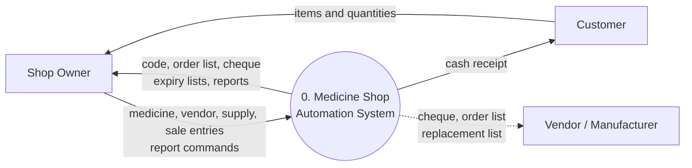
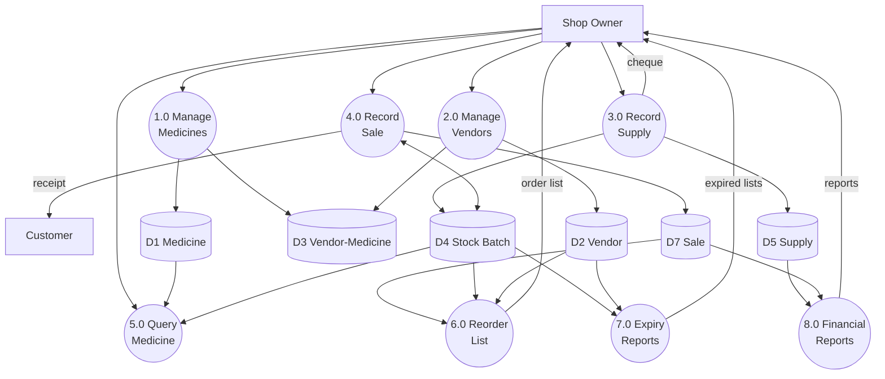
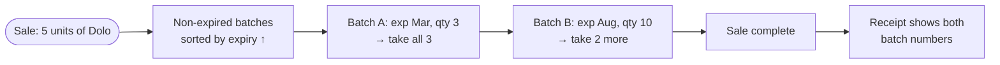
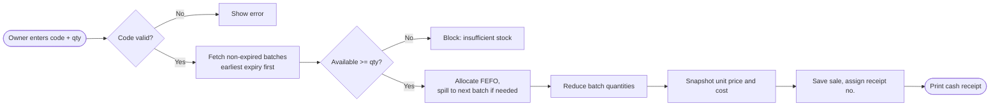
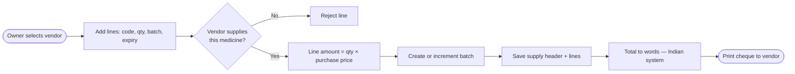
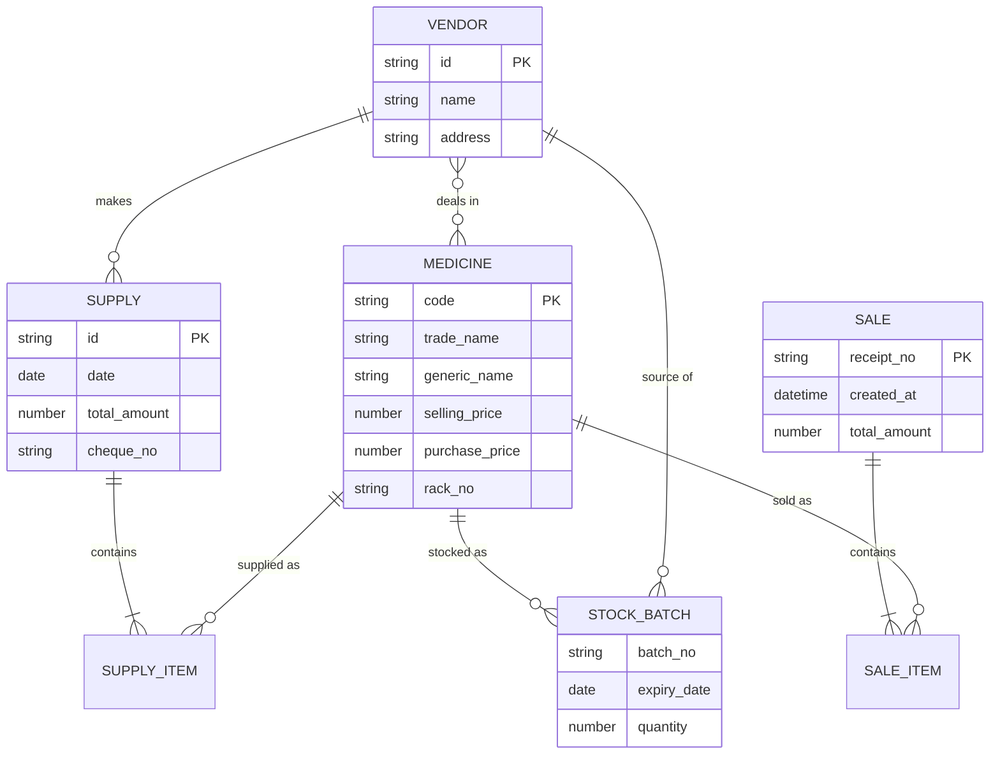
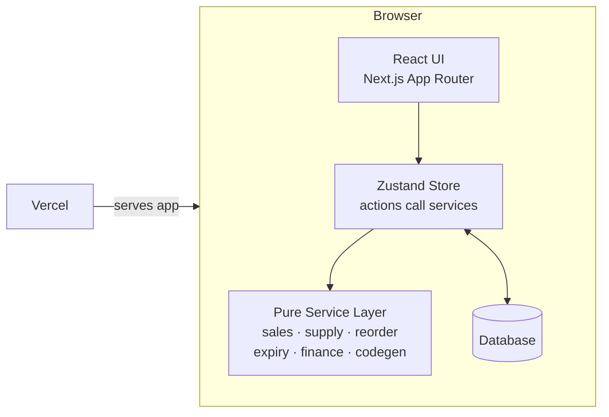

<style>
h1 { color: #0F766E !important; font-weight: 700; }
h2 { color: #10B981 !important; }
th { background: #0F766E; color: white; }
a { color: #0F766E; }
.slidev-layout { overflow: hidden; }
</style>

# Medicine Shop Automation (MSA)

Group P · Software Engineering · 30/09/26

<!--
This project automates a retail medicine shop: inventory, purchasing, sales, expiry handling and reporting. We used structured analysis and design and built a working app deployed on Vercel.
-->

---

# The Real Problem

<div class="grid grid-cols-2 gap-8 mt-6">
<div>

**What we observed at a typical retail pharmacy:**

- Owner manages **200+ medicines** across 30–40 wall racks
- Stock checked by **walking the aisles manually** every day
- Expiry dates checked **by hand on every batch**, one shelf at a time
- Reorder decisions made from **gut feel** — often too late or too early
- Sales receipts written **by hand** on a notepad
- Profit calculated once a month from stacks of paper

</div>
<div>

**The consequences:**

- 🕒 **2–3 hours/day** lost to manual checks
- 💸 Expired stock written off with **no record of loss**
- 📦 Stockouts on fast-moving medicines, overstocking on slow ones
- 🧾 Receipt disputes — no record after the notepad fills up
- 📉 No visibility into which medicines are actually profitable

</div>
</div>

<!--
We interviewed a shop owner in Pune. These numbers are real. The expiry check alone takes over an hour daily.
-->

---

# Why Automate This?

<div class="grid grid-cols-3 gap-6 mt-8">
<div class="p-4 rounded-xl bg-teal-50 border border-teal-200">
<div class="text-2xl mb-2">🏥</div>
<b>Patient safety</b><br/>
<span class="text-sm">Selling expired medicine is a health and legal risk. It must be eliminated, not just reduced.</span>
</div>
<div class="p-4 rounded-xl bg-teal-50 border border-teal-200">
<div class="text-2xl mb-2">⚖️</div>
<b>Regulatory compliance</b><br/>
<span class="text-sm">Drug licensing requires traceable batch records, receipts, and vendor documentation.</span>
</div>
<div class="p-4 rounded-xl bg-teal-50 border border-teal-200">
<div class="text-2xl mb-2">📊</div>
<b>Business survival</b><br/>
<span class="text-sm">Thin margins in retail pharmacy mean waste and stockouts directly threaten profitability.</span>
</div>
<div class="p-4 rounded-xl bg-emerald-50 border border-emerald-200">
<div class="text-2xl mb-2">⏱️</div>
<b>Owner's time</b><br/>
<span class="text-sm">Every hour saved on stock-checking is an hour available for serving customers.</span>
</div>
<div class="p-4 rounded-xl bg-emerald-50 border border-emerald-200">
<div class="text-2xl mb-2">🔍</div>
<b>Traceability</b><br/>
<span class="text-sm">When a recall happens, you need to know exactly which batches you sold and to whom.</span>
</div>
<div class="p-4 rounded-xl bg-emerald-50 border border-emerald-200">
<div class="text-2xl mb-2">💡</div>
<b>Insight</b><br/>
<span class="text-sm">Which medicines make money? Which vendor is slow? The owner currently has no way to know.</span>
</div>
</div>

---

# Objectives

<div class="grid grid-cols-3 gap-5 mt-6 text-sm">
<div class="p-3 rounded-xl bg-slate-50 border border-slate-200">📦 <b>Never run out</b><br/>Auto reorder list from sales trends</div>
<div class="p-3 rounded-xl bg-slate-50 border border-slate-200">⏳ <b>Never sell expired</b><br/>Daily vendor-wise expiry report</div>
<div class="p-3 rounded-xl bg-slate-50 border border-slate-200">🧾 <b>Fast billing</b><br/>Cash receipt per sale with FEFO batch tracking</div>
<div class="p-3 rounded-xl bg-slate-50 border border-slate-200">✍️ <b>Accurate purchasing</b><br/>Cheque printed per supply, vendor linked</div>
<div class="p-3 rounded-xl bg-slate-50 border border-slate-200">📈 <b>Business insight</b><br/>Revenue, gross profit, vendor payments</div>
<div class="p-3 rounded-xl bg-slate-50 border border-slate-200">🔎 <b>Easy lookup</b><br/>Query by name, code, rack or generic</div>
</div>

---

# Requirements → Features

<div class="text-sm mt-2">

| # | Requirement | MSA Feature |
|---|---|---|
| 1 | Weekly average sales; order when stock < threshold | Reorder (`/reorder`) |
| 2 | End-of-day order list with vendor address | Reorder, printable |
| 3 | Vendor name, address, medicines dealt | Vendors (`/vendors`) |
| 4 | New supply entry; print cheque | Receive Supply (`/supply`) |
| 5 | New medicine; auto code for rack | Medicines + Rack Label |
| 6 | Query by generic or trade name | Query (`/query`) |
| 7 | Daily expired + vendor-wise list | Expiry (`/expiry`) |
| 8 | Record sale; print receipt | New Sale POS (`/sales`) |
| 9 | Revenue, profit, vendor payments | Reports (`/reports`) |

</div>

---

# Our Approach

<div class="grid grid-cols-2 gap-8 mt-4">
<div>

**Methodology: Structured Analysis & Design**

1. **Requirements** — interview + domain research
2. **Structured Analysis** — DFDs (L0, L1, L2), Data Dictionary, ER Diagram
3. **Structured Design** — Structure Chart, module decomposition
4. **Implementation** — Next.js + TypeScript, pure-function service layer
5. **Testing** — Vitest unit tests for all business logic
6. **Deployment** — Vercel (zero-config, static hosting)

</div>
<div>

**Key design decisions made early:**

- Stock is **derived** from batch quantities — never stored directly
- Business logic lives in **pure functions** — fully testable without a browser
- **FEFO** (First-Expiry-First-Out) enforced at every sale
- Price **snapshot** on each sale item — historical profit stays accurate even after price changes

</div>
</div>

---

# Context Diagram (Level 0 DFD)



<div class="mt-4 text-sm text-slate-600">

The **shop owner** is the only direct user of the system. Customers and vendors interact only through **printed outputs** (receipts, cheques, order lists) — they never log in.

</div>

---

# Level-1 DFD



---

# Data Stores

<div class="grid grid-cols-2 gap-4 mt-4 text-sm">
<div>

| ID | Store | Key Contents |
|---|---|---|
| D1 | Medicine | code, names, prices, rack no. |
| D2 | Vendor | vendor no., name, address |
| D3 | Vendor-Medicine | who supplies what |
| D4 | Stock Batch | medicine, batch, expiry, qty, vendor |

</div>
<div>

| ID | Store | Key Contents |
|---|---|---|
| D5 | Supply | vendor, date, total, cheque no. |
| D6 | Supply Item | medicine, batch, expiry, qty, cost |
| D7 | Sale | receipt no., date/time, total |
| D8 | Sale Item | medicine, batch, qty, price, cost snapshot |

</div>
</div>

<div class="mt-5 p-3 bg-amber-50 border border-amber-200 rounded-xl text-sm">

⚠️ <b>Design decision:</b> Stock on hand is <b>never stored</b>. It is always derived at query time as <code>SUM of non-expired batch quantities</code>. This eliminates an entire class of consistency bugs.

</div>

---

# Why FEFO Matters

<div class="grid grid-cols-2 gap-8 mt-4">
<div>



<div class="mt-4 text-sm text-slate-600">
Allocation spans multiple batches automatically. The receipt records every batch number consumed for full traceability.
</div>

**Without FEFO:**
- A batch received in Jan (expires March) may sit behind a batch received in Dec (expires Dec)
- The January batch expires on the shelf
- Owner loses money, patient gets old stock

</div>
</div>

---

# Level-2 DFD: Record Sale



<div class="mt-3 text-sm text-slate-600">
Price snapshot at sale time means that if the selling price changes tomorrow, all historical profit calculations remain correct.
</div>

---

# Level-2 DFD: Record Supply



<div class="mt-3 text-sm">
The number-to-words conversion handles the Indian numbering system (lakh, crore).
Example: ₹1,23,456 → <i>"Rupees One Lakh Twenty Three Thousand Four Hundred Fifty Six Only"</i>
</div>

---

# Financial Reports

<div class="grid grid-cols-2 gap-6 mt-4">
<div class="grid grid-cols-2 gap-3 text-sm">
<div class="p-3 rounded-xl bg-teal-50 border border-teal-100"><b>Revenue</b><br/>Σ qty × unit selling price</div>
<div class="p-3 rounded-xl bg-teal-50 border border-teal-100"><b>COGS</b><br/>Σ qty × unit cost snapshot</div>
<div class="p-3 rounded-xl bg-teal-50 border border-teal-100"><b>Gross Profit</b><br/>Revenue − COGS</div>
<div class="p-3 rounded-xl bg-teal-50 border border-teal-100"><b>Vendor Payments</b><br/>Σ supply totals per vendor</div>
</div>
<div>

**Why this matters:**

- Without reports, the owner knew total sales but not profit — COGS was invisible
- Price snapshots on sale items mean profit is accurate even after price changes
- Vendor payment totals let the owner see who they owe money to
- Date-range picker covers daily, monthly or custom periods
- Recharts line chart shows daily revenue and profit trends

</div>
</div>

---

# Data Dictionary

<div class="grid grid-cols-2 gap-4 mt-4 text-xs font-mono">
<div class="bg-slate-50 rounded-xl p-3 border border-slate-200">

**Medicine**
`code + trade_name + generic_name`
`+ selling_price + purchase_price + rack_no`

**Vendor**
`vendor_no + name + address + {medicine_code}`

**StockBatch**
`medicine_code + batch_no + expiry_date`
`+ quantity + vendor_no`

**Sale**
`receipt_no + datetime + total_amount + {SaleItem}`

</div>
<div class="bg-slate-50 rounded-xl p-3 border border-slate-200">

**SaleItem**
`medicine_code + batch_no + quantity`
`+ unit_price + unit_cost`

**Supply**
`supply_id + vendor_no + date + total_amount`
`+ cheque_no + {SupplyItem}`

**SupplyItem**
`medicine_code + batch_no + expiry_date`
`+ quantity + unit_cost`

**ReorderLine**
`medicine_description + qty_required`
`+ vendor_name + vendor_address`

</div>
</div>

<div class="mt-2 text-xs text-slate-500">`+` composition &nbsp;·&nbsp; `{ }` repetition</div>

---

# Entity-Relationship Diagram



---

# System Architecture




---

# Technology Stack

<div class="grid grid-cols-2 gap-4 mt-4 text-sm">
<div>

| Layer | Choice | Why |
|---|---|---|
| Framework | Next.js 14 (App Router) | File-based routing, SSG, `@media print` |
| Language | TypeScript | Catch data shape errors at compile time |
| Styling | Tailwind CSS | No CSS files, consistent spacing |
| State | Zustand + persist | Simple, no boilerplate, localStorage sync |

</div>
<div>

| Layer | Choice | Why |
|---|---|---|
| Charts | Recharts | Composable, responsive SVG charts |
| Forms | react-hook-form + Zod | Validated inputs with type inference |
| Icons | lucide-react | Consistent, tree-shakeable |
| Tests | Vitest | Fast, Jest-compatible, no config |

</div>
</div>

---

# Testing Strategy

<div class="grid grid-cols-2 gap-8 mt-4">
<div>

**What we tested (Vitest):**

- `processSale` — FEFO allocation, oversell guard, price snapshots
- `processSupply` — batch upsert, vendor validation
- `calculateReorderReport` — weekly average, threshold, order qty
- `generateExpiryReport` — expired batch detection, grouping
- `calculateFinancialSummary` — revenue, COGS, profit, vendor totals
- `numberToWordsIndian` — edge cases (lakh, crore, zero, decimals)

</div>
<div>

**Why pure functions made this easy:**

```
// No mocks, no database, no browser
it('allocates FEFO correctly', () => {
  const result = processSale(state, items);
  expect(result.sale.items[0].batchNo)
    .toBe('earliest-expiry-batch');
});
```

All service functions take state as input and return new state as output. Tests are fast, deterministic and require no setup.

</div>
</div>


---
layout: center
class: text-center
---

# Conclusion

<div class="text-lg mt-4 space-y-2">

A **real problem** → a structured process → a **working system**

From 2 hours of manual stock checks to **one click**

From handwritten receipts to **batch-tracked, FEFO-allocated cash memos**

From gut-feel reordering to **data-driven JIT order lists**

</div>

<div class="mt-8 text-2xl font-bold text-teal-700">
Live demo: <code>https://msa-ism.vercel.app</code>
</div>

<div class="mt-8 text-slate-500">Thank you. Questions?</div>
